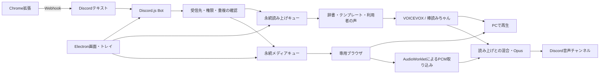

# にゃんとーく〜Damare〜の設計と統合方針

更新日: 2026-10-05。PC側「にゃんとーく〜Damare〜」v0.3.0 を実装しました。上流Chrome拡張 v0.1.2 を残し、常時稼働Windows PC上のDiscord.js Botで受信・読み上げ・メディア再生を管理します。[導入と操作](DESKTOP.md)・[機能対応と未解決点](FEATURE_PARITY.md)も参照してください。

## ユーザー指定の要件

- Chrome拡張「にゃんぷれい」は送信側として維持する。
- 下流は常時実行Windows PC内のDiscord.js Botを含むデスクトップアプリとする。
- Discord読み上げBot、棒読みちゃん、DiSpeak、AHKブラウザ再生の全機能を対象とする。
- VOICEVOX本体の全UIは移植対象外とし、ずんだもんの全声種を必須とする。
- 上流をSNS・ニコニコへ広げ、メディア検出時にボタンから送信画面を開く仕様を維持する。

これらは最終形の要件です。元製品のURL・版とAHK本体を回収し、対応表の不足を埋める必要があります。v0.3.0を全機能移植完了とは扱いません。

## アーキテクチャ



メインプロセスがBot・キュー・合成API・設定を管理します。操作画面はローカルHTMLに限定し、preloadの限定IPCで操作します。外部サイトの再生ウィンドウは別セッションで、Node.js・preload・サイト権限を与えません。再生ウィンドウの音声だけを取り込み、PC全体のマイクや音は取り込みません。

受信はサーバー・チャンネル、WebhookとBot、除外条件、受信IDを照合します。管理コマンドはサーバー管理権限または登録利用者に限定します。再生命令は読み上げキューへ流しません。VOICEVOXの声種はAPIから取得し、ずんだもんの8トークスタイルを確認します。棒読みちゃんの声番号とは分けて設定します。

読み上げは逐次キュー、動画はサーバーごとに独立した逐次キューにし、動画中に読み上げを重ねます。PC・Discord・両方への出力を選べ、読み上げ中は動画音量を下げます。1サーバーにつき1音声チャンネルへ接続します。

## 常時運転と保存

二重起動防止、トレイ、Windowsログイン時起動、Bot自動接続、入室時接続・退出、Discord.jsの回線再接続、Windows復帰の検知を実装しています。Windowsサービスではなくログイン中のユーザーセッションで実行します。

設定・キュー・受信IDはJSONを原子的に置換して保存します。再起動時の実行中項目は「中断」とし、明示的に再試行します。待機1000件、履歴1000件、受信ID10000件、メモリログ500件を上限にします。失敗後も後続を処理します。エンジン異常終了後の自動再起動と長時間運転試験は未実施です。

トークンはWindowsのDPAPIで暗号化し、設定・バックアップ・配布物に含めません。設定のインポート時は自動起動・自動接続・エンジン実行ファイルを無効にします。

## 再生と上流互換性

既存拡張の `URL再生` / `URL無限` とタイトルを受信し、URL時刻を開始位置へ変換します。将来用の `NYANPLAY/1` JSON命令も受け付けます。専用ブラウザのHTML5 video/audioに対し、通常・無限再生、開始位置、一時停止、終了検知、スキップ、時間上限を管理します。

許可ホストの通常HTTP/HTTPS URLのみ受信し、遷移先も確認します。ファイルURL・IPアドレス・localhost・未許可ホストは除外します。ユーザーのChromeを強制終了しません。SNS・ニコニコ向けの共通受信はありますが、サイト別DOM・ログイン・DRMは通し試験が必要です。拡張側のSNS検出ボタン追加は別に残っています。

## ソースと配布

```text
extension/                  上流Chrome拡張 v0.1.2
apps/desktop/main.mjs        ElectronとIPC
apps/desktop/core/           設定・保存・プロトコル・辞書・キュー・合成
apps/desktop/runtime/        Bot・音声・ブラウザ・認証・エンジン起動
apps/desktop/renderer/       日本語の設定画面
scripts/                    検査・画面試験・拡張ZIP
tests/                     受信・権限・復旧・音声の自動試験
docs/                      導入・設計・対応表
```

Windows x64のNSISインストーラーとZIPをGitHub Actionsで作成します。Node.js・Discord.js・Opus・FFmpeg、対応するChrome拡張、文書・第三者表記を同梱します。VOICEVOX Engine・モデル・外部エンジン・exVOICE素材は同梱せず、用意したエンジンを接続・起動します。管理導入・同梱はライセンスと容量の確認後に追加する項目です。

Chrome拡張はユーザーがChrome側で読み込みます。Native Messagingは将来候補で、現在はDiscord経由です。Colabは過去の資料の参照対象で、必須環境にはしません。

## 過去チャット

「YTにゃんぷれい_AHKClab」の直近5ターンを確認しました。AHK v1.1、通知検知、Chrome終了処理があり、末尾は `Kill_Chrome_Once.ahk` の生成でした。古いターンのカーソルがなく、再生処理本体と添付AHKは回収できていません。削除された通知監視を再導入する要件はありません。過去の発言は資料として扱い、現在の指定を優先します。原文と認証情報は公開していません。

## サーバー間の再生と読み上げ

`bot.masterTextChannelId` からのメディアはmasterキューで、参加している全VCへ同じPCMを送ります。通常メディアはguild別のブラウザ・キューで独立並行再生します。マスタ再生中は各通常レーンを一時停止し、共通キュー終了後に再開します。途中参加したVCも共通音声の現在位置から受信します。停止・一時停止コマンドはそのサーバーに適用し、マスタチャンネルからは共通キューに適用します。PC画面の全体操作は全キューを対象とします。

`disabledTextChannelIds` は読み上げだけを無効にし、管理操作とメディアの受信を維持します。転送は明示したfrom/toサーバー間で片方向・双方向・なしを設定し、元の1件を合成して各対象へ送ります。転送したDiscordメッセージの再送や再帰転送は行いません。

## Android・X・LAN音声

Androidは公式EmulatorとGoogle Play対応x86_64イメージを管理導入し、ADB経由の表示・操作をアプリ画面へ組み込みます。利用規約を表示したバージョンだけを導入し、公式カタログから安定版を取得します。同APIはイメージ・Emulatorを更新し、別APIは別AVDを作って旧端末を残します。Windowsの仮想化機能と実起動は利用環境での確認が必要です。

Xは公式API2、複数対象アカウント、OAuth2 PKCE、RT、本文なしメディア除外を実装します。非公開アカウントはフォロー権限だけでは取得せず、本人のユーザーIDに一致したログイン中だけ対象とします。ログアウト時に非公開ジョブを中止・伏せ字にします。

LANのPC/スマホ共通URL・マイク許可・双方向音声は [LAN設計](LAN_VOICE_DESIGN.md) にまとめました。HTTPS、部屋権限、WebRTC、中継時の自己音声除外、Discord受信を前提とします。v0.3.0には待受け実装を含めません。

棒読みちゃんの実ZIP取得と元設定は [移行文書](BOUYOMI_IMPORT.md) を参照してください。現在は元本体の処理を利用する互換経路で、完全な新エンジンへの移植が完了した状態ではありません。
