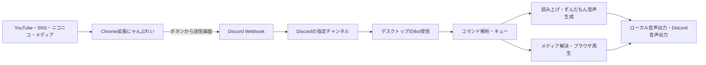

# にゃんぷれいのデスクトップ統合方針

更新日: 2026-10-05。ユーザーが指定した役割分担と統合対象を記録した設計文書です。今回の実行コードは添付CRX由来のChrome拡張v0.1.2であり、デスクトップアプリとSNS対応の実装は今後の作業です。

## 確定した役割分担

**上流の送信側はChrome拡張「にゃんぷれい」として維持し、下流の受信・読み上げ・メディア再生を一つのデスクトップアプリへまとめます。**

下流は**常時稼働するWindows PC内で動作する、Discord.js前提の常時実行Bot**とします。Node.jsランタイムをアプリの配布物に含め、Discord.jsをBot処理の基盤にします。画面を閉じた場合の常駐継続とBot停止を区別し、同じPCで二重起動しない構成とします。

デスクトップアプリの統合対象は、Discord読み上げBot、読み上げちゃん、VOICEVOXによるずんだもん音声、DiSpeak、AHKスクリプトでブラウザ再生している処理です。拡張側はYouTubeに加え、各種SNS・ニコニコ動画の再生可能なメディアを送信できるようにします。

ユーザー指定の「VOICEBOX」は、ずんだもんを提供するVOICEVOXを想定しています。音声生成の経路は置き換え可能ですが、ずんだもんの全声種を使えることを必須条件とします。

**VOICEVOX以外は、各統合元アプリケーションに存在する全機能を対象にします。** 少数の読み上げ・再生機能だけに絞った置き換えは最終形としません。VOICEVOX本体の編集画面・プロジェクト管理などの全機能移植は対象外ですが、指定されたずんだもん全声種の利用は必須です。機能の棚卸しと完了判定は[FEATURE_PARITY.md](FEATURE_PARITY.md)で管理します。



これは将来の構成図です。現在の拡張機能はWebhookへ送信するところまでを実装しています。

## 統合する機能

| 統合対象 | デスクトップ側へまとめる役割 | 確認・移行の方針 |
| --- | --- | --- |
| Discord読み上げBot | 元Botの全機能、設定、コマンド、メッセージ受信・判定・音声出力 | Bot認証で接続し、Webhook投稿も対象にする。使用していた版の全機能を棚卸し |
| 読み上げちゃん | 元アプリの全機能、読み上げ設定、辞書、声種などの利用体験 | 製品と版を特定し、全機能と移行形式を整理 |
| VOICEVOX／代替経路 | ずんだもんの全スタイルを使う音声生成 | Engine APIまたはCore＋モデルを候補に、全スタイル対応と再配布条件を確認 |
| DiSpeak | 元アプリの全機能、Discordチャットからローカル読み上げへ橋渡しする処理 | 公開実装と実際の利用版の全機能を棚卸しし、現行APIに対応した受信・変換・出力へ集約 |
| AHKのブラウザ再生部分 | 元スクリプトの全機能。URLを開く、再生開始、時刻指定、ループ、停止、終了管理を含む | 最終ソースを回収し、全処理を常時実行Bot内の再生管理へ移植 |

DiSpeakの公開説明では、Discordのチャットを**棒読みちゃん**へ渡すツールです。ユーザー指定の「読み上げちゃん」と同一製品とは扱いません。公開リポジトリはMITライセンスで、開発停止・アーカイブ状態が示されています。機能と移植可能なコードを確認してから利用します。[DiSpeakの公開リポジトリ](https://github.com/yudukiak/DiSpeak)

第三者製品の機能を集約することと、そのバイナリ・サービス自体を同梱することは分けて判断します。利用していた読み上げBotと読み上げちゃんの配布元・実装はまだ取得していません。

## ずんだもんの全声種

VOICEVOXの公式モデル対応表で確認したトークスタイルは次の8種類です。これを初期受け入れ条件に含め、起動時にはエンジンから取得した一覧と突き合わせます。追加された声種も選択できる設計とし、特定のID一覧だけを固定して終わらせません。[公式VVMモデル・スタイル対応表](https://github.com/VOICEVOX/voicevox_vvm)

| スタイル | 現在確認したID |
| --- | --- |
| ノーマル | 3 |
| あまあま | 1 |
| ツンツン | 7 |
| セクシー | 5 |
| ささやき | 22 |
| ヒソヒソ | 38 |
| ヘロヘロ | 75 |
| なみだめ | 76 |

エンジン方式では`/speakers`から「ずんだもん」の全スタイルを取得し、そのIDでクエリ生成・合成を行います。全スタイルで短文を合成・再生する検査を統合版の必須項目にします。別の音声生成経路を採用する場合も、声種の選択・全種の再生・必要な表示を満たすことを条件とします。[VOICEVOX EngineのAPI説明](https://github.com/VOICEVOX/voicevox_engine/blob/master/README.md)

「全声種」は読み上げ用トークスタイルを最低条件とします。歌唱スタイルも公式一覧から取得できる構成を候補にしますが、歌唱機能の提供範囲は実装時に別途決めます。

音声モデルの利用条件とアプリ本体のライセンスは個別に扱います。公式モデルの説明にある`VOICEVOX:ずんだもん`のクレジットを、アプリの情報画面・配布文書と必要な利用場面で表示する設計にします。[公式の音声ライブラリ利用条件](https://github.com/VOICEVOX/voicevox_vvm#音声ライブラリ利用規約)

## Discord受信と再生の流れ

拡張機能からDiscordへのWebhook送信を残し、受信側アプリにDiscord Botの接続・読み上げ・メディア再生を集約します。Bot設定は許可されたサーバーとチャンネルを選ぶ方式とし、必要なIntent・権限を導入画面で確認します。[Discord Gatewayの公式仕様](https://docs.discord.com/developers/events/gateway)

Bot処理はDiscord.jsで実装し、Botトークンで認証します。Discord.jsから受け取ったイベントを共通処理へ渡し、音声チャンネルとの接続にも対応する音声ライブラリを使います。一般ユーザーのログインセッションをBot認証の代わりにする方式は採用しません。

一般的なBot投稿の除外処理で、にゃんぷれいのWebhook投稿まで除外しないようにします。許可したWebhook・チャンネルからの再生命令を受け付け、アプリ自身の応答は再処理しません。DiscordのメッセージIDで再接続時の重複を抑え、再生待ち・読み上げ待ち・失敗状態を画面で確認できるようにします。

既存の`URL＋再生/無限＋タイトル`形式は、移行中に受信側で読み取れるようにします。新形式ではページURL、メディア候補ID、タイトル、メディア種別、開始時刻、ループ指定、仕様バージョンを明示し、短縮URLへの依存を減らします。実行用コマンドと、読み上げる自然文を分け、再生命令全文を誤って読み上げることを防ぎます。

音声出力はローカル再生とDiscordのボイスチャンネル送信を別の出力先として設計します。ブラウザから鳴る音をDiscordへ送る機能は、音声取り込み・ルーティングの検証を別途必要とします。読み上げと動画音声の音量、割り込み・待機、停止・スキップ、終了後の次項目への遷移を一つの画面から管理します。

常時運転に必要な再接続、Windows起動時の自動起動設定、スリープ・回線断からの復帰、キューと設定の永続化、音声エンジン・再生プロセスの異常終了からの復旧、ログの容量制限を備えます。操作画面には接続状態、Bot開始・停止、待機項目、読み上げ・再生の状態を表示します。アプリ終了時はBot接続とアプリ所有プロセスを終了します。

## ブラウザ再生とAHKの移行

AHKの役割を、ブラウザ操作、再生待ち、停止・終了、補助メンテナンスへ分解して回収します。現在取得できたチャット末尾のChrome終了スクリプトだけを、再生処理全体とみなしません。

再生管理には、アプリが所有する専用ブラウザプロファイルまたは埋め込みプレイヤーを使う方法を検討します。初期段階では互換アダプタからAHKを起動できる構成も候補とし、最終的には起動・再生・停止・終了状態をアプリの管理下に置きます。必要なログインは再生環境で行い、ユーザーが普段使うChromeのCookieや全プロセスに依存する設計を避けます。

過去チャットでは通知監視・ループ・常駐処理を削除してChromeを一回だけ終了する変更がありました。その通知監視を再導入する要件はありません。全Chrome終了処理は通常の再生停止に使わず、必要なら対象と影響を示した単発の補助操作として残します。

## リポジトリ・一つの配布パッケージ

ソースは同じリポジトリで管理し、デスクトップアプリの設定・辞書・再生制御・音声生成を一つの導入と更新手順にまとめます。Chrome拡張は独立した送信側として残し、互換性のある版を同じリリースに含めます。

```text
yt-nyan-play/
  extension/              上流Chrome拡張
  apps/desktop/           統合デスクトップアプリ
  packages/discord/       Bot受信・音声接続
  packages/tts/           VOICEVOXと代替音声生成アダプタ
  packages/playback/      SNS・ニコニコ・メディア解決と再生
  packages/protocol/      メッセージ形式・互換性仕様
  integrations/legacy/    回収したAHK等の移行用コード
  scripts/                検査・ビルド・配布物作成
  docs/                   構成・導入・移行・仕様
```

この構成への変更は関連コードを回収してから行います。今回、未実装ディレクトリや第三者製品の推測による代替ソースは追加していません。

Windows版の配布は、デスクトップアプリ、必要なランタイム・モデル、対応する拡張機能フォルダ、第三者ライセンス一覧、初期設定手順をまとめる形を目標にします。同梱できない依存物は、同じ導入画面から取得・設定する方式を検討します。Webhook・Botトークン・署名鍵は配布物へ含めず、設定後にOSの認証情報保管へ保存します。

Chromeウェブストア版の拡張機能は引き続きChrome側の導入・更新手順を持ちます。デスクトップ側の同梱だけで、利用者の操作なしに拡張機能が導入される前提にはしません。

Native Messagingによるローカル直接送信は将来の選択肢として残します。基本構成はDiscordへの送信と受信を維持し、このリポジトリのv0.1.2にはNative Messagingの権限を追加していません。

Colabは過去の構成を調べるための参照対象です。今回指定された統合対象の必須実行環境には含めず、ソース回収後に必要な処理をローカルへ移せるか確認します。

## 実装順序と完了条件

1. 添付CRX由来のソース、検査・ZIP作成、過去チャットの参照範囲をGitHubへ保存する。
2. AHKのブラウザ再生処理、使っていた読み上げBot・読み上げちゃん、DiSpeakの利用版を回収し、VOICEVOX以外の全機能と移行方法を棚卸しする。
3. Windows上の常時実行Discord.js Bot、ずんだもん全声種、ローカル・Discord音声出力を一つのアプリで動作させる。
4. メディア再生管理とSNS・ニコニコの対応を追加し、拡張とアプリの送受信を通して検証する。
5. 設定移行、導入・更新、音声モデル、第三者表記を含む一つの配布パッケージを作成する。

統合版の完了条件は、VOICEVOX以外の統合元の全機能を機能対応表で確認できること、Windowsの常時実行Discord.js Botとして動作すること、ずんだもんの全トークスタイルが再生できること、拡張の送信画面と宛先選択を維持すること、送信・受信・再生失敗が表示されること、アプリが所有する再生プロセスを終了できることです。

拡張側の検出条件・SNS対応・送信画面の詳細は[EXTENSION_SPEC.md](EXTENSION_SPEC.md)に記録しています。

## 過去チャットの参照範囲

「YTにゃんぷれい_AHKClab」が見つかり、取得可能な直近5ターンを確認しました。内容はAHK v1.1、通知検知、Chrome終了処理で、最後の生成ファイル名は`Kill_Chrome_Once.ahk`です。読み取り結果には古いターンを取得するカーソルがなく、元のブラウザ再生処理や添付ファイル本体は回収できていません。

過去の発言は設計資料として扱い、今回のユーザー指定の構成を優先しています。チャットの原文、ログ、個人情報、認証情報をそのまま公開資料へコピーしていません。
