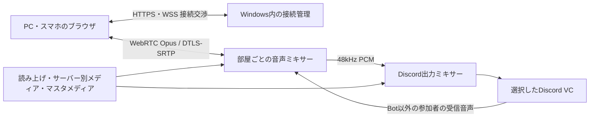

# LAN内ブラウザからDiscordへ音声を送る設計

更新日: 2026-10-05。これは実装用の設計です。v0.3.0にLAN待受け・WebRTC音声転送の実装は含めません。動作しない操作画面は追加しません。

## 利用方法

常時稼働Windows PCのにゃんとーくを音声中継サーバーにします。PC・Android・iPhoneは同じHTTPS URLへアクセスし、公開された接続先からDiscordのサーバー・VCを選んで「通話に参加」を押します。初回はブラウザのマイク許可が必要です。参加後は話す・聞くの両方が動作し、送信ミュート、受信音量、接続先変更、退出を操作できます。端末に専用アプリを入れません。

「参加」のクリックは、iOS/Safari等の音声自動再生制限を解除するためにも使います。次回から同じURLを開けますが、OS・ブラウザが許可を取り消した場合は再度許可が必要です。

## 構成と音声経路

ブラウザは `getUserMedia({audio:{echoCancellation:true,noiseSuppression:true,autoGainControl:true}})` で取り込み、WebRTCのマイクトラックを送ります。中継側は音声を48kHzステレオPCMへ統一します。部屋は既存の `guildId + voiceChannelId` に結びつけ、1サーバーにつきBotが参加する1VCという制約を保ちます。異なるサーバーのメディア・会話は混ぜません。マスタメディアだけを全ての公開部屋へ配信します。

Discord受信時にはBotの `selfDeaf:false` が必要です。`@discordjs/voice` の receiverから参加者のOpusを復号し、話し終わりでトラックを終了します。Bot自身の送信音声と自分のマイクは本人へ戻しません。各端末に返す音声はその端末のマイクを除いた合成音声とし、エコーと転送ループを防ぎます。読み上げのサーバー間転送設定は合成読み上げだけに適用し、VC会話を暗黙に他サーバーへ転送しません。

既存のメディア取り込みはAudioWorkletのPCM経路を再利用します。ブラウザからの音声をイベントごとの音声ファイルとして保存せず、連続トラックとして扱います。既定では録音・履歴保存を行いません。

## HTTPSと共通URL

LAN IPの `http://192.168...` は安全なコンテキストにならず、スマホのマイク許可が使えません。証明書警告を無視する構成は採用しません。PC・スマホで信頼される証明書を前提にします。

| 方法 | 共通URLと導入 |
| --- | --- |
| 所有ドメインとDNS-01証明書 | 例 `https://talk.example.net:11489`。LAN内DNSはWindows PCの固定IPへ解決。DNS-01で証明書を更新し、インターネットからPCへのポート公開は不要 |
| LAN用の独自CA | 例 `https://nyantalk.home.arpa:11489`。LAN DNSとサーバー証明書を設定し、全端末へCAを信頼登録。iOSでは証明書の完全な信頼設定も必要 |

固定IPまたはDHCP予約を使います。外部のSTUN/TURNは既定で利用せず、同じLANのhost candidateを使います。端末のmDNS候補やWi-Fiクライアント分離で接続できない場合は原因を表示します。ゲストWi-Fi等の端末間通信禁止を回避する機能は設けません。

## 接続管理とAPI

Windows画面でLAN機能の有効化、待受けLANインターフェース、公開するVC、証明書、同時接続数を設定します。既定は無効。Windows Firewallは選択したPrivateプロファイル・ローカルサブネットだけを対象とし、追加するルールとポートをアプリから確認できます。ルーターのポート開放は行いません。

| エンドポイント | 内容 |
| --- | --- |
| `GET /` | PC/スマホ共通の通話ページ |
| `GET /api/rooms` | 公開した部屋名・接続可否。Botトークンや管理設定を返さない |
| `POST /api/session` | 必要な場合のPC側ペアリングコード確認と短時間の接続権限発行 |
| `WSS /signal` | `join`, `offer`, `answer`, `ice`, `mute`, `leave`, `heartbeat` の交換 |

初回アクセスでマイク権限だけを求める運用も選べますが、接続者は公開した部屋だけを利用できます。必要に応じてPCで発行するペアリングコードを有効にします。サーバー/VCはクライアントが送る任意IDをそのまま使わず、発行済みの部屋IDと権限から確定します。Originと部屋参加権限を検証し、接続数、メッセージサイズ、交渉頻度、PCMキュー長を制限します。

## 復帰と受け入れ試験

端末のスリープ・Wi-Fi切替・タブのバックグラウンド化を検知し、ICE再交渉と短時間の再接続を行います。失敗時は「再接続」を表示し、マイク送信が止まったことを明示します。VC退出・Bot停止・部屋の公開解除はその部屋の全接続を終了します。

Windows PC + Chrome/Edge、Android Chrome、iPhone Safariで、同一URL・証明書信頼・初回マイク許可・双方向音声を検証します。2端末同時参加、自己音声が返らないこと、複数サーバーの分離、マスタ再生、読み上げとの混合、切断復帰、管理者による退出、未公開部屋への拒否を確認します。WebRTC実装の選定後、WindowsでのOpus復号・音声出力遅延と長時間運転を測定します。
