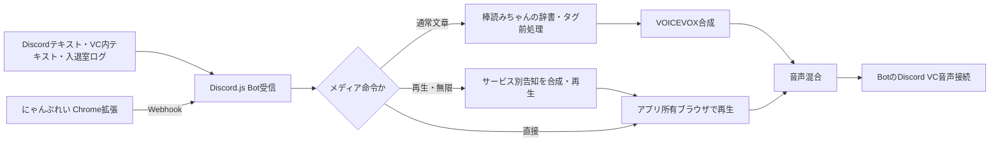

# 元構成を維持する統合方針

ユーザー確認済みの元構成は、DiSpeakでDiscordにログインし、指定テキストチャンネル・VC内テキスト・VC入退室/移動ログを棒読みちゃんへ渡す流れです。棒読みちゃんの辞書・タグ処理を経て、にゃんぷれい要求はAHKでブラウザを開いて再生し、通常文章はVOICEVOXで音声化します。両方の音声をVoicemeeterから、同じユーザーアカウントでVC接続しているDiscordアプリのマイクへ送っていました。

統合後はDiscordの受信・接続をDiscord.jsのBot認証へ変更します。Windows内の文章処理、合成、ブラウザ再生をアプリで管理し、PCM混合した音声をBotのVC接続へ直接送ります。Voicemeeterを経由する音声ルーティングとAHKのブラウザ操作をアプリ内の処理に置き換え、入力文・辞書処理・開始位置・告知・再生時間の挙動を維持する方針です。

マスタ以外のメディア・読み上げキューはサーバーごとに独立させます。転送対象へは設定した片方向・双方向・転送なしの規則だけで音声を送り、再投稿による読み上げ循環を作りません。マスタテキストチャンネルからのメディアは接続済みVCで共通再生し、元のサーバー別メディアを一時停止して終了後に戻します。

再生・無限・直接・ていしの具体的な入力と出力は [DESKTOP.md](DESKTOP.md#元構成の再生停止とbotアクティビティ) に記録します。「無限」は繰り返しではなく終端まで1回です。再生告知はサービス名に合わせ、告知完了後にページを開きます。平文ていしは対象サーバーのメディアを停止し、待機読み上げより先に停止告知を送ります。停止告知の間はそのVCへの通常音声を待機させ、他のサーバーの出力は継続します。

再生アクティビティはBot全体で1つの表示として、マスタ優先・それ以外は最新開始のサービス名とタイトルを示します。終了時には他の再生へ戻し、再生がなくなるとクリアします。

v0.4.0で前版との差を修正したのは、無限のループ化、45秒制限と開始前告知の欠落、直接/平文ていしの未受信、VC内テキストの未受信、全サーバーの読み上げが単一キューになる部分、新規取り込みで棒読みちゃんのローカル出力だけを選択していた部分です。既に保存した出力先は利用者の設定として保持し、新規設定・新規取り込みはDiscord出力を選びます。

元の辞書処理からVOICEVOXへ接続する経路は追加しましたが、Command/CommandW・Reverb・左右別Volume等の完全互換は未完です。声登録と元のVOICEVOX連携方式、元AHK全体も確認待ちです。現時点の実装範囲と未解決項目は [FEATURE_PARITY.md](FEATURE_PARITY.md)、原本設定の移行一覧は [BOUYOMI_IMPORT.md](BOUYOMI_IMPORT.md) で管理します。
